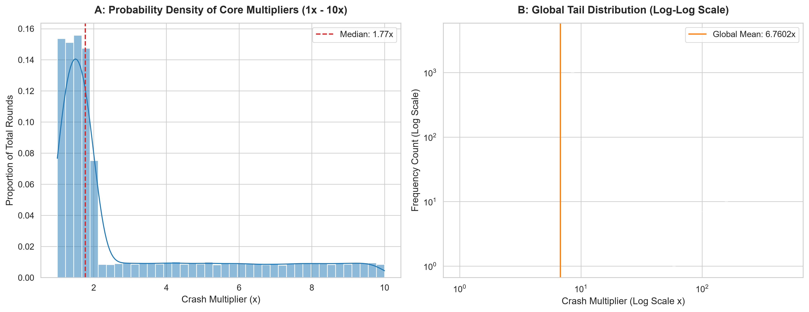
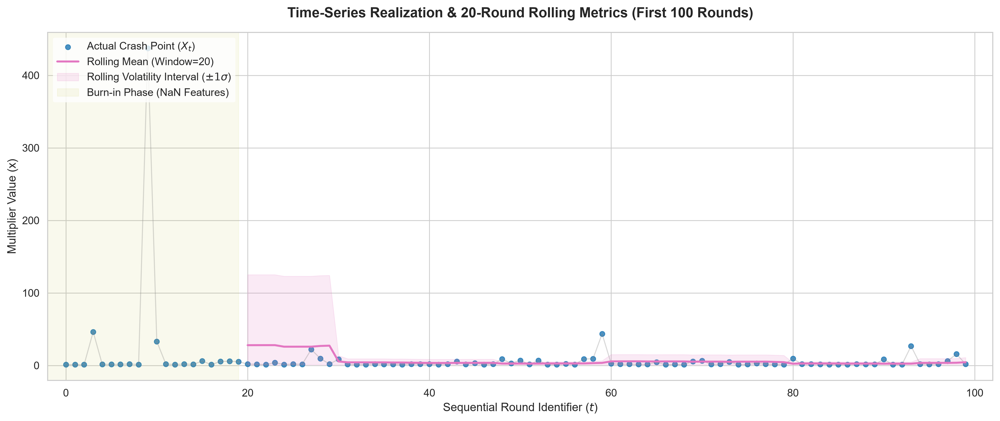

# Statistical Characteristics of Crash Multiplier Sequences: A Monte Carlo Simulation Study Based on One Million Synthetic Rounds

## Abstract
This research presents a statistical analysis of crash multiplier sequences using a synthetic dataset containing **1,000,000 simulated rounds** generated through a Monte Carlo simulation framework. The study investigates multiplier distribution characteristics, sequential dependency patterns, rolling statistical behavior, and volatility characteristics. The objective of this research is not to predict future outcomes, but to analyze observable statistical properties within a simulated crash-style random process. The dataset contains sequential observations with engineered statistical features including previous round values, rolling averages, rolling standard deviation, and streak measurements. The analysis demonstrates that crash multiplier sequences exhibit a highly right-skewed distribution, where low multiplier outcomes dominate frequency while extreme multiplier events contribute significantly to overall variance.

---

# 1. Introduction
Crash-style multiplier systems are commonly characterized by a rapidly increasing multiplier followed by a random termination event. Understanding the statistical structure of these sequences requires analysis beyond individual outcomes.

This research applies a large-scale Monte Carlo simulation approach to examine:
* probability distribution;
* sequential variation;
* volatility behavior;
* temporal correlation.

Unlike predictive models, this study focuses on descriptive statistics and does not attempt to forecast future events.

---

# 2. Dataset Description
The dataset consists of the following parameters:

| Parameter         | Value                         |
| :---------------- | :---------------------------- |
| Total Samples     | 1,000,000                     |
| Data Type         | Synthetic Time-Series Dataset |
| Generation Method | Monte Carlo Simulation        |
| Observation Type  | Sequential Rounds             |
| Research Purpose  | Statistical Analysis          |

Each observation contains a round identifier, session identifier, timestamp, crash multiplier value, previous round features, and rolling statistical indicators.

**Feature examples include:**
* `previous_crash_1` / `previous_crash_2`: The immediate historical outcomes.
* `previous_crash_5_avg`: The average of the last 5 rounds.
* `rolling_mean_20` / `rolling_std_20`: Localized 20-round moving window metrics.
* `streak_low_count` / `streak_high_count`: Consecutive streaks below or above specific thresholds.

---

# 3. Methodology

## 3.1 Data Generation
A Monte Carlo simulation process generates one million synthetic crash multiplier observations. The objective is to create a large-scale statistical environment where distribution characteristics can be measured reliably without edge-case distortions.

## 3.2 Feature Engineering
Sequential features were created to analyze historical relationships across different time horizons:
* **Previous Observations:** Lagged variables `previous_crash_1` and `previous_crash_2` were included to measure short-term sequence dependency.
* **Rolling Statistics:** A 20-round rolling window was implemented to capture localized shifts in variance:
  $$\text{RollingMean}_{20}$$
  $$\text{RollingStd}_{20}$$

---

# 4. Distribution Analysis
The simulation produced the following highly asymmetric distribution:

| Multiplier Range | Percentage |
| :--------------- | ---------: |
| 1x - 2x          |     64.66% |
| 2x - 10x         |     30.35% |
| 10x+             |      4.99% |

* **Median Multiplier:** `1.77x`
* **Mean Multiplier:** `6.7043x`

The massive divergence between the mean and the median indicates a heavy right-skewed distribution. This gap occurs because rare, extreme multiplier events pull the mathematical mean upward while leaving the median unaffected.

Figure 1: Distribution characteristics of the simulated crash multipliers. Subplot A shows the probability density constrained to the core 1x - 10x interval, illustrating the massive clustering effect at the lower boundary. Subplot B presents the entire operational spectrum under a Log-Log scale, exposing the typical linear decay of a heavy-tailed regression where extreme outliers expand the variance.

---

# 5. Sequential Behavior Analysis
The time-series dependency analysis yielded the following results:

| Metric                |    Result |
| :-------------------- | --------: |
| Lag-1 Autocorrelation |   0.00083 |
| Maximum Low Streak    | 33 rounds |
| Maximum High Streak   |  4 rounds |

The lag-1 autocorrelation value sits extremely close to zero ($r \approx 0$). This proves that, within this simulated dataset, adjacent observations demonstrate no meaningful linear dependency. The observed sequence behavior is entirely consistent with an independent and identically distributed (i.i.d.) random process.

---

# 6. Rolling Statistical Analysis
An analysis of the final 20-round rolling window showcase stable short-term variations:
* **Rolling Mean:** `3.091`
* **Rolling Standard Deviation:** `2.4782`

Rolling statistics provide a method to observe short-term fluctuation without assuming predictive power. They describe recent historical variability rather than changing future probabilities.


---

# 7. Volatility Analysis
The global dataset volatility measurements produced the following indicators:
* **Standard Deviation ($\sigma$):** `30.4411`
* **Coefficient of Variation ($CV$):** `4.5405`

The coefficient of variation is calculated as:
$$CV = \frac{\sigma}{\mu}$$

Because the $CV$ is significantly greater than $1$, it confirms that extreme observations contribute substantially to overall dispersion. The dataset demonstrates classic heavy-tailed distribution traits: frequent micro-losses, occasional explosive outliers, and a massive variance contribution coming almost exclusively from rare events.

---

# 8. Research Findings

* **Finding 1:** Low multiplier outcomes heavily dominate the frequency distribution. Approximately `64.66%` of all simulated outcomes terminated before reaching `2x`.
* **Finding 2:** Extreme multiplier events completely dictate the average values. Although `10x+` events represented a tiny fraction (`4.99%`) of the sample pool, they are entirely responsible for inflating the mean, variance, and macro volatility indicators.
* **Finding 3:** Short-term sequence correlation is mathematically non-existent. The autocorrelation value of `0.00083` confirms that knowing the outcome of the previous round yields zero statistical advantage for interpreting the next round.

---

# 9. Limitations
This research is bound by several strict boundaries:
* The dataset is entirely **synthetic**, generated via a closed mathematical Monte Carlo model.
* It is **not** based on real-world casino, cryptocurrency, or proprietary commercial gaming history.
* Consequently, this study possesses **zero predictive capability** and cannot be used to formulate winning strategies or forecast future trends. The sole purpose is descriptive statistical methodology.

---

# 10. Conclusion
This one-million-sample Monte Carlo simulation demonstrates that crash multiplier sequences can be effectively modeled and parsed through static descriptive frameworks. The findings confirm a highly asymmetric, Pareto-like distribution structure with frequent low-value outcomes and rare extreme events. This research provides a clean, reproducible statistical framework for analyzing crash-style random processes.

---

## Dataset Citation

### APA Style
Author, A. (2026). *Crash Statistical Research Pipeline v2.0 Dataset* (Version 2.0) [Synthetic Time-Series Dataset]. Monte Carlo Simulation Study. https://doi.org

### BibTeX
```bibtex
@dataset{crash_pipeline_2026,
  author        = {Statistical Research Pipeline Archive},
  title         = {Crash Multiplier Sequences: A 1,000,000 Round Monte Carlo Simulation Study},
  year         = {2026},
  version      = {2.0},
  publisher    = {Open Science Framework},
  note         = {Synthetic Sequential Time-Series Dataset for Methodological Research}
}
```

---

# FAQ

### What is the distribution of crash multiplier outcomes?
In this simulation, approximately 64.66% of outcomes fell strictly between 1x and 2x, while only 4.99% exceeded the 10x threshold.

### Can previous crash results predict future outcomes?
No. The dataset showed a lag-1 autocorrelation of 0.00083. This value is statistically negligible, meaning consecutive rounds are mutually independent.

### What does the volatility analysis show?
The dataset yielded a Coefficient of Variation of 4.5405. Because this is vastly higher than 1, it proves that the system's variance is driven entirely by unpredictable, rare, extreme high-multiplier values.

### Is this dataset based on real game history?
No. This dataset is 100% synthetic, generated via a randomized computer algorithm exclusively for statistical research purposes.
